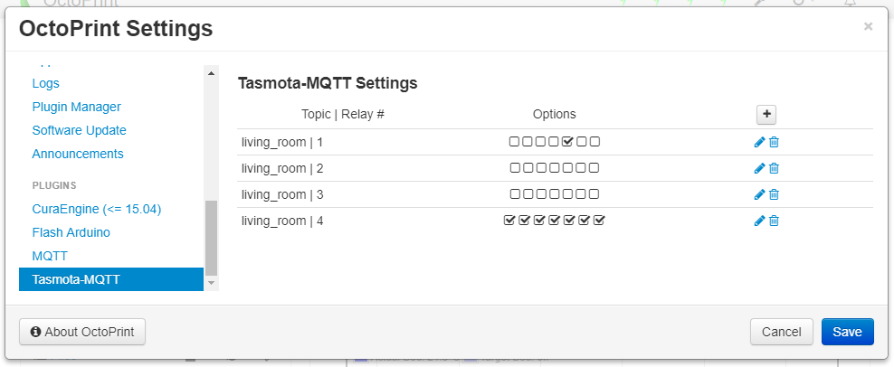

# OctoPrint-TasmotaMQTT

This plugin allows the control of [Tasmota](https://github.com/arendst/Sonoff-Tasmota) devices from within OctoPrint via [MQTT](https://github.com/arendst/Sonoff-Tasmota/wiki/MQTT-Overview#mqtt-overview) commands.

## Prerequisites

Install the [MQTT](https://github.com/OctoPrint/OctoPrint-MQTT) plugin via the Plugin Manager or manually using this url:

	https://github.com/OctoPrint/OctoPrint-MQTT/archive/master.zip
	
## Setup

Install via the Plugin Manager or manually using this URL:

    https://github.com/jneilliii/OctoPrint-TasmotaMQTT/archive/master.zip

## Configuration

- Once installed you need to configure the "Full Topic" EXACTLY the same way like in your Tasmota devices. It can be found at the Tasmota device web-service page under information. Copy it over to make sure it is identical. E.g., **%topic%/%prefix%/**
- add a Relay device and configure
 - **Topic:** is the name of the Tasmota device
 - **Relay #:** For multiple relay devices enter the index number that matches your desired relay. For single relay devices like the [iTead Sonoff S20 Smart Socket](https://www.itead.cc/smart-socket.html), leave it blank.
 - **Icon class:** lets you select the icon to be shown on the front page.
 - **Warning Prompt:** Issues always an addtional warning to avoid accidentally switching.
 - **Warn While Printing:** Issues an addtional warning only if a print is in progress. 
 - **Auto Connect:** Connect to the printer N seconds after power was switched on. The time delays can help to establish a stable connection. 	
 - **Auto Disconnect:** Disconnects the printer N seconds prior of switching off the power.  
 - **GCODE Trigger:** Enable the switching via M80 and M81 code. See below.
 - **GCODE On Delay:** Time delay in seconds after receiving M80 before switching on.
 - **GCODE Off Delay:** Time delay in seconds after receving M81 before switching off. 
 - **Run System Command After On:** Issue a system command after switching on. 
 - **Run System Command Before Off:** Issue a system command after switching off.
### GCODE config
If GCODE Trigger is switched on, the plugin looks out for Gcode to switch the relay on resp. off. This can be used to switch the printer on at the start of a print and off right after a print is finished. The delay times can be used to e.g. to let the printer powered on for a certain time after the print is finished e.g. to let fans running helping to cool down quicker.

The usual format of the GCODE which performs the trigger of the relay is:

**M80|M81 TOPIC RELAY#**

Explanation:
- M80 -- Switch on
- M81 -- Switch off
- TOPIC: Name of the device to be switched (same as in the Tasmota device)
- RELAY#: Number of the relay to be switched. Leave it empty for single relay units.

This can be included either in the slicer settings to be added in front resp. at the end of a gcode file. Or in Octoprint itself, under `Settings->Printer->GCODE scripts` in the fields `Before print job starts` and `After print job completes`. 

Examples:

* `M80 sonoff_printer` To turn a single-relay Tasmota unit named "sonoff_printer" on.
* `M81 4chpro_printer 1`  Turn off relay number 1 of a multiple relay Tasmota device named "4chpro_printer". 	

## Screenshots

## Most recent changelog

**[0.3.8](https://github.com/jneilliii/OctoPrint-TasmotaMQTT/releases/tag/0.3.8)** (11/22/2020)

**Added**

* startup event monitoring
* upload event monitoring if print is flagged to start automatically
* new access control permissions to replace deprecated user_permission
* idle timer reset/restart if relay is powered on outside of OctoPrint
* release channels for OctoPrint 1.5.0+ for future rc testing, similar to OctoPrint as described [here](https://community.octoprint.org/t/how-to-use-the-release-channels-to-help-test-release-candidates/402)

**Updated**

* knockout sortable library for OctoPrint 1.5.0 compatibility

**Fixed**

* issues with startup and idle timer

### [All releases](https://github.com/jneilliii/OctoPrint-TasmotaMQTT/releases)

## Get Help

If you experience issues with this plugin or need assistance please use the issue tracker by clicking issues above.

### Additional Plugins

Check out my other plugins [here](https://plugins.octoprint.org/by_author/#jneilliii)

### Sponsors
- Andreas Lindermayr
- [@Mearman](https://github.com/Mearman)
- [@TheTuxKeeper](https://github.com/thetuxkeeper)
- [@tideline3d](https://github.com/tideline3d/)
- [SimplyPrint](https://simplyprint.dk/)
- [Andrew Beeman](https://github.com/Kiendeleo)
- [Calanish](https://github.com/calanish)
- [Will O](https://github.com/4wrxb)
- [Lachlan Bell](https://lachy.io/)
- [Johnny Bergdal](https://github.com/bergdahl)
- [Leigh Johnson](https://github.com/leigh-johnson)
- [Stephen Berry](https://github.com/berrystephenw)
- [Guyot François](https://github.com/iFrostizz)
- César Romero
- [Steve Dougherty](https://github.com/Thynix)

## Support My Efforts
I, jneilliii, programmed this plugin for fun and do my best effort to support those that have issues with it, please return the favor and leave me a tip or become a Patron if you find this plugin helpful and want me to continue future development.

 

<small>No paypal.me? Send funds via PayPal to jneilliii&#64;gmail&#46;com</small>
